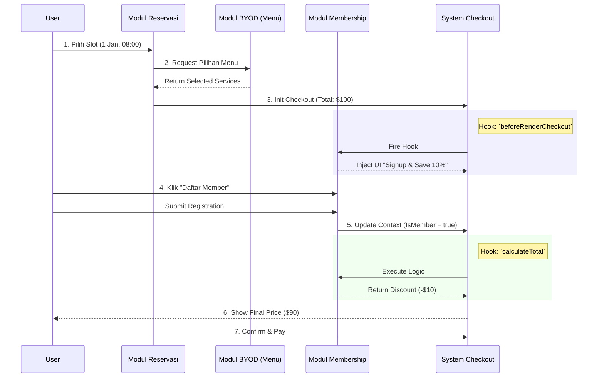

# Analisis Arsitektur: Integrasi Modul Membership

Use case ini (Reservasi + Menu + Membership Upsell) membutuhkan **Module Interoperability**. Modul tidak bisa berdiri sendiri secara isolasi; mereka harus berkomunikasi.

## Tantangan Utama
1.  **Shared State**: Reservasi perlu tahu item apa yang dipilih (BYOD).
2.  **Logic Injection**: Membership perlu memotong harga (Diskon 10%) di dalam logic pembayaran module lain.
3.  **UI Injection**: Membership perlu menampilkan "Banner Promo" di dalam flow reservasi.

## Solusi Arsitektur: "Module Hooks & Events"

Kita perlu memperluas definisi Modul untuk mencakup **Hooks**.

### Diagram Interaksi



### 1. Perluasan Struktur Modul
Kita update `ModuleDefinition` di `MODULAR_SYSTEM_ANALYSIS.md` untuk support **Hooks**.

```typescript
interface ModuleDefinition {
    id: string;
    // ... basic props ...
    
    // Logic Injection
    hooks?: {
        // Modul ini mendengarkan event apa?
        "checkout:calculate_total"?: "lib/hooks/applyMemberDiscount.ts",
        "checkout:before_render"?: "components/MemberUpsellWidget.tsx"
    }
}
```

### 2. Implementasi Use Case

#### Modul Membership
*   **Hooks**: 
    1.  `checkout:before_render`: Cek user belum member? Render komponen `UpsellBanner`.
    2.  `checkout:calculate_total`: Cek user member? Return `{ type: 'discount', amount: 0.1 }`.

#### Modul Reservasi & BYOD
*   Modul ini harus menjadi **Emitter**.
*   Saat render checkout page, dia memanggil:
    ```tsx
    <ModuleHookPoint name="checkout:before_render" context={cartData} />
    // Render semua komponen hook yang terdaftar (mis: Banner Member)
    ```
*   Saat hitung total:
    ```typescript
    let total = basePrice;
    const modifiers = await runHooks('checkout:calculate_total', { user, cart });
    // modifiers = [{ type: 'discount', value: 10 }]
    ```

---

## Rekomendasi Update Roadmap

Ini menambah kompleksitas **Phase 2 (Architecture)**. Kita perlu membangun **Event Bus / Hook System** sederhana.

1.  **Block Registry** (untuk UI statis) -> *Selesai di rencana awal*
2.  **Hook Registry** (untuk Logic & UI dinamis antar modul) -> *Perlu ditambahkan*

### Verifikasi Arsitektur

Jika kita design BYOD POS sekarang, kita harus pastikan Cart/Checkout logic-nya **terbuka** (open for extension), tidak hardcoded. logic hitung total harus function yang bisa di-intercept.
