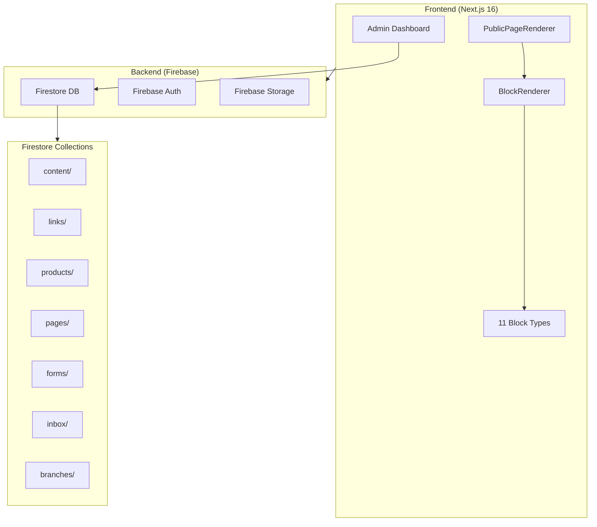
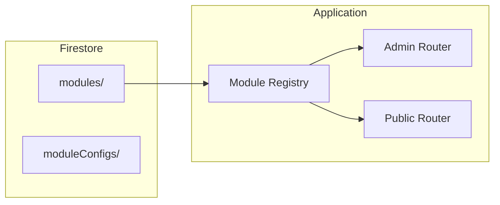
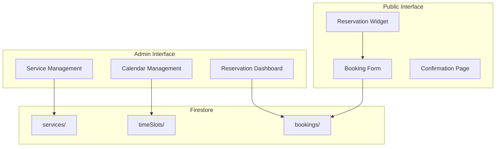
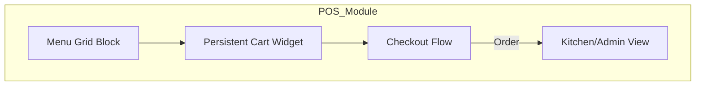
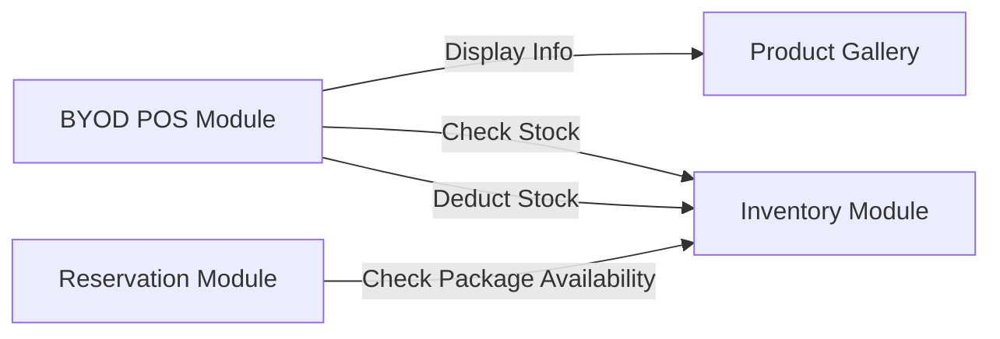

# Analisis Arsitektur & Strategi Sistem Modular

Dokumen ini berisi analisis menyeluruh arsitektur saat ini dan rekomendasi strategi untuk sistem modular yang dapat mendukung berbagai modul seperti BYOD POS, Sistem Reservasi, dll.

## Ringkasan Arsitektur Saat Ini



### Tech Stack
| Layer | Technology |
|-------|------------|
| Frontend | Next.js 16, React 19, TypeScript |
| Styling | Tailwind CSS 4 |
| Backend | Firebase (Firestore, Auth, Storage) |
| Hosting | Firebase Hosting with SSR |

---

## Analisis Detail

### 1. Block System (Existing Pattern)

Sistem sudah memiliki **block-based architecture** yang bagus melalui:

- `BlockRenderer.tsx` - Dynamic rendering dengan code splitting
- `PublicPageRenderer.tsx` - Main page orchestrator
- 11 block types: `hero`, `text`, `image`, `button`, `products`, `faq`, `link`, `map`, `image_gallery`

> [!TIP]
> Pattern ini **sudah mendukung extensibility**: Dynamic imports memungkinkan penambahan block baru tanpa mengubah core bundle.

### 2. Admin Dashboard Structure

Admin sidebar di `AdminSidebar.tsx` memiliki **hardcoded navigation**:

```javascript
const navItems = [
    { icon: LayoutDashboard, label: 'Overview', href: '/admin' },
    { icon: Inbox, label: 'Inbox', href: '/admin/inbox' },
    { icon: LinkIcon, label: 'Links', href: '/admin/links' },
    // ... hardcoded items
];
```

> [!CAUTION]
> Ini merupakan **bottleneck utama** untuk modularitas. Setiap modul baru memerlukan code changes.

### 3. Data Model

Firestore structure saat ini adalah **flat collections**:

```
firestore/
├── content/         → Profile, settings, featured product
├── links/           → Quick action links
├── products/        → Product catalog
├── pages/           → Custom pages with blocks
├── forms/           → Form builder forms
├── inbox/           → Form submissions
└── branches/        → Business locations
```

---

## Masalah yang Perlu Diselesaikan

| # | Problem | Impact |
|---|---------|--------|
| 1 | **Tidak ada Module Registry** | Tidak bisa enable/disable fitur dari backend |
| 2 | **Hardcoded Admin Navigation** | Setiap modul baru butuh code deployment |
| 3 | **Tidak ada Tenant/Account Isolation** | Current design single-tenant |
| 4 | **Block types hardcoded** | Modul baru tidak bisa extend blocks |
| 5 | **Permissions per module tidak ada** | Tidak bisa kontrol akses per modul |

---

## Rekomendasi Strategi Modular

### Phase 1: Module Registry Foundation

**Goal**: Backend-driven module activation tanpa code deployment



#### Proposed Firestore Structure

```
firestore/
├── modules/                    # NEW: Module definitions
│   ├── reservation/
│   │   ├── enabled: true
│   │   ├── displayName: "Sistem Reservasi"
│   │   ├── icon: "calendar"
│   │   ├── adminRoute: "/admin/reservation"
│   │   ├── publicRoute: "/reservation"
│   │   └── role: ["admin", "editor"]
│   ├── byod_pos/
│   │   ├── enabled: false
│   │   ├── displayName: "BYOD POS"
│   │   └── ...
│   └── catalog/               # Built-in module (always on)
│
├── moduleConfigs/             # NEW: Per-module settings
│   ├── reservation/
│   │   ├── timeSlots: [...]
│   │   ├── services: [...]
│   │   └── notifications: {...}
│   └── byod_pos/
│       └── ...
```

#### Dynamic Admin Sidebar

```javascript
// AdminSidebar.tsx

- const navItems = [...hardcoded...];
+ const [modules, setModules] = useState<Module[]>([]);
+ 
+ useEffect(() => {
+     // Fetch enabled modules from Firestore
+     const unsubscribe = onSnapshot(
+         query(collection(db, 'modules'), where('enabled', '==', true)),
+         (snapshot) => setModules(snapshot.docs.map(...))
+     );
+     return unsubscribe;
+ }, []);
+
+ const navItems = [
+     ...coreItems,  // Dashboard, Inbox (always visible)
+     ...modules.map(m => ({
+         icon: ICON_MAP[m.icon],
+         label: m.displayName,
+         href: m.adminRoute
+     }))
+ ];
```

---

### Phase 2: Module Architecture

#### Module Interface Specification

```typescript
// types/modules.ts (NEW)

interface ModuleDefinition {
    id: string;
    displayName: string;
    description: string;
    icon: string;
    version: string;
    
    // Routing
    adminRoutes: AdminRoute[];
    publicRoutes: PublicRoute[];
    
    // Extension Points
    blocks?: BlockDefinition[];      // Custom blocks for page builder
    widgets?: WidgetDefinition[];    // Dashboard widgets
    hooks?: ModuleHooks;             // NEW: Inter-module communication
    
    // Firestore
    collections: string[];           // Collections this module uses
    
    // Dependencies
    requires?: string[];             // Other modules required
}

// NEW: Hook definitions
interface ModuleHooks {
    // Actions: Logic that runs on specific events (e.g., calculation modifiers)
    actions?: Record<string, string>; // eventName -> handlerFunctionPath
    
    // Components: UI that injects into slots (e.g., upsell banners)
    components?: Record<string, string>; // slotName -> componentPath
}

interface AdminRoute {
    path: string;
    label: string;
    icon: string;
    component: string;               // Dynamic import path
}
```

#### Phase 2b: Module Interoperability (Hooks)

Untuk mendukung use case kompleks seperti Membership Discount di dalam Reservasi, kita membutuhkan **Hook System**:

1.  **Action Hooks**: Untuk memodifikasi logic.
    *   Example: `checkout:calculate_total` -> Membership module returns discount modifier.
2.  **Component Injection**: Untuk menyisipkan UI.
    *   Example: `checkout:before_submit` -> Membership module renders "Sign up for 10% off" banner.

```typescript
// lib/modules/hooks.ts (Conceptual)
export async function runLogicHooks(eventName: string, context: any) {
    const hooks = getEnabledHooks(eventName); // From DB/Registry
    let results = [];
    for (const hook of hooks) {
        // Execute hook logic
        results.push(await hook.execute(context));
    }
    return results;
}
```

#### Module Directory Structure

```
src/
├── modules/                        # NEW: Module implementations
│   ├── core/                       # Built-in core features
│   │   ├── profile/
│   │   ├── links/
│   │   ├── products/
│   │   └── pages/
│   │
│   ├── reservation/                # Reservation Module
│   │   ├── manifest.json           # Module metadata
│   │   ├── admin/
│   │   │   ├── page.tsx            # Admin UI
│   │   │   └── components/
│   │   ├── public/
│   │   │   ├── ReservationWidget.tsx
│   │   │   └── BookingForm.tsx
│   │   ├── blocks/                 # Custom blocks
│   │   │   └── ReservationBlock/
│   │   ├── lib/
│   │   │   ├── types.ts
│   │   │   └── api.ts
│   │   └── hooks/
│   │
│   └── byod_pos/                   # BYOD POS Module
│       ├── manifest.json
│       ├── admin/
│       ├── public/
│       └── ...
```

---

### Phase 3: Dynamic Routing

#### App Router Structure Changes

```
app/
├── admin/
│   ├── (dashboard)/
│   │   ├── [...moduleRoute]/       # NEW: Catch-all for modules
│   │   │   └── page.tsx            # Dynamic module loader
│   │   ├── layout.tsx
│   │   └── page.tsx
│
├── [slug]/                         # Existing
│   └── page.tsx
│
├── m/                              # NEW: Module public routes
│   └── [...modulePath]/
│       └── page.tsx                # Dynamic public module loader
```

#### Dynamic Module Loader

```typescript
// app/admin/(dashboard)/[...moduleRoute]/page.tsx

export default async function ModulePage({ params }) {
    const modulePath = params.moduleRoute.join('/');
    
    // 1. Find matching module from registry
    const module = await findModuleByRoute(modulePath);
    if (!module || !module.enabled) {
        return notFound();
    }
    
    // 2. Dynamic import module component
    const ModuleComponent = dynamic(
        () => import(`@/modules/${module.id}/admin/page`),
        { loading: () => <ModuleSkeleton /> }
    );
    
    return <ModuleComponent moduleConfig={module.config} />;
}
```

---

## Contoh: Implementasi Modul Reservasi (ALINA Spa)



### Module Manifest

```json
// modules/reservation/manifest.json
{
    "id": "reservation",
    "displayName": "Sistem Reservasi",
    "description": "Booking dan manajemen reservasi untuk layanan",
    "icon": "calendar",
    "version": "1.0.0",
    
    "adminRoutes": [
        { "path": "/reservation", "label": "Reservasi", "icon": "calendar" },
        { "path": "/reservation/services", "label": "Layanan", "icon": "list" }
    ],
    
    "publicRoutes": [
        { "path": "/book", "component": "BookingPage" }
    ],
    
    "blocks": [
        { "type": "reservation_cta", "label": "Booking Button" },
        { "type": "service_list", "label": "Service List" }
    ],
    
    "collections": ["services", "timeSlots", "bookings"]
}
```

---

## Migration Strategy

### Langkah Implementasi

| Phase | Scope | Effort | Priority |
|-------|-------|--------|----------|
| **1.1** | Module Registry Collection | 1-2 days | 🔴 High |
| **1.2** | Dynamic Admin Sidebar | 2-3 days | 🔴 High |
| **1.3** | Module types & interfaces | 1 day | 🔴 High |
| **2.1** | Refactor existing features as core modules | 3-5 days | 🟡 Medium |
| **2.2** | Dynamic admin routing | 2-3 days | 🟡 Medium |
| **2.3** | Extend block system for modules | 2-3 days | 🟡 Medium |
| **3.1** | Implement Reservation module | 5-7 days | 🟢 Low |
| **3.2** | Implement BYOD POS module | 7-10 days | 🟢 Low |

### Backward Compatibility

> [!IMPORTANT]  
> Existing features (Products, Links, Pages, Forms) harus di-wrap sebagai "core modules" yang selalu enabled. Ini memastikan zero downtime migration.

---

## Design Decisions

Based on user feedback, the following decisions have been finalized:

1.  **Module Activation Granularity**: **Single-tenant / Global**.
    *   Activation acts effectively as a "Site Setting".
    *   Enabled modules are active for the entire application instance.
2.  **Block Extension**: **Enabled**.
    *   Modules **MUST** be able to register new block types.
    *   `BlockRenderer` needs to be refactored to check a dynamic registry of blocks in addition to the core hardcoded ones.
3.  **Priority**: **BYOD POS** First.
    *   Pilot implementation will be the **BYOD POS** module.
    *   Reservation system follows, utilizing the menu components from BYOD POS.

---

## Revised Implementation Strategy

### Phase 1: Module Registry & Block System Support

**Goal**: Backend-driven module activation & Dynamic Block System.

#### 1.1 Firestore Registry
Same as initial analysis, but simplified for single-tenant (global `modules` collection).

#### 1.2 Extensible Block System (CRITICAL Update)

We need a way for modules to inject blocks into the `BlockRenderer`.

**Proposed Pattern: Block Registry**
```typescript
// lib/modules/registry.ts (Conceptual)
import { CoreBlocks } from '@/components/blocks';

// Map of blockType -> Component Import
export const BlockRegistry = {
    ...CoreBlocks,
   // Module blocks will be injected here or looked up dynamically
};

// components/blocks/BlockRenderer.tsx
// Updated to check module registry if core block not found
```

*Challenge*: Since we use dynamic imports for performance, we cannot easily "scan" directories at runtime in client code.
*Solution*: A `block-manifest.json` or similar in Firestore that maps `blockType` -> `moduleID`. The `BlockRenderer` can use a generic `ModuleBlockLoader` component for non-core blocks.

```tsx
// BlockRenderer.tsx
case 'core_hero': return <HeroBlock ... />;
// ...
default:
  // If unrecognized core block, check if it's a module block
  if (isModuleBlock(block.type)) {
     return <ModuleBlockLoader type={block.type} data={block.data} />
  }
```

---

## Pilot: BYOD POS Implementation (Updated)



### Manifest
```json
// modules/byod_pos/manifest.json
{
    "id": "byod_pos",
    "displayName": "Self-Order Menu (BYOD)",
    "blocks": [
        { "type": "pos_menu_grid", "label": "Menu Grid" },
        { "type": "pos_floating_cart", "label": "Floating Cart Button" }
    ],
    "adminRoutes": [
        { "path": "/pos/orders", "label": "Active Orders" },
        { "path": "/pos/settings", "label": "POS Settings" }
    ]
}
```


---

## New Module: Inventory System (Backend Core)

**Goal**: Centralized stock management that other modules (POS, Reservation) can consume.
**Key Concept**: "Separation of concerns" - Product Gallery is for **Display/Marketing**, Inventory is for **Operations/Stock**.

### Architecture: Gallery vs. Inventory

| Feature | **Product Gallery Module** (`products/`) | **Inventory Module** (`inventory/`) |
| :--- | :--- | :--- |
| **Primary Audience** | Customers (Public) | Staff/Admin (Internal) |
| **Data Owned** | Title, Description, Image, Category, Base Price | SKU, Stock Level, Cost Price, Supplier info |
| **Source of Truth** | Content & Marketing info | Availability & COGS |
| **Dependency** | Independent | referencing `productId` |

### Database Structure

```typescript
// inventory/ (Collection)
interface InventoryItem {
    id: string;
    sku: string;
    name: string;
    currentStock: number;
    lowStockThreshold: number;
    unit: string; // e.g., "pcs", "bottle", "serving"
    
    // Link to public product (Optional - items can be raw materials)
    linkedProductId?: string; 
}

// inventory_transactions/ (Collection) - Ledger
interface StockTransaction {
    itemId: string;
    change: number; // +10, -1
    reason: "purchase" | "sale" | "adjustment" | "waste";
    referenceId?: string; // OrderID or PO Number
    timestamp: Timestamp;
}
```

### Module Interactions (Hooks)

The Inventory module acts as a **Service Provider** to consumer modules.



#### Workflows

**1. POS Order Flow (Inventory Check)**
1.  **User** opens POS Menu.
2.  **POS Module** fetches `products` linked with `inventory` status.
    *   *Mechanism*: `inventory:get_stock_bulk(productIds)` hook.
3.  **App** greys out items with `stock <= 0` (if logic dictates).
4.  **User** places order.
5.  **POS Module** triggers `checkout:finalize`.
6.  **Inventory Module** listens to `checkout:finalize` -> deducts stock.

**2. Reservation with Add-ons**
1.  **User** selects "Spa Package".
2.  **Reservation Module** checks configuration: Package requires "1x Premium Oil".
3.  **Reservation Module** calls `inventory:check_availability(oil_sku, quantity)`.
4.  If available, proceed to booking.

### Manifest Update

```json
// modules/inventory/manifest.json
{
    "id": "inventory",
    "displayName": "Inventory Management",
    "icon": "box",
    "adminRoutes": [
        { "path": "/inventory", "label": "Stock List" },
        { "path": "/inventory/transactions", "label": "History" }
    ],
    "hooks": {
        "actions": {
            "order.created": "hooks/deductStock",
            "order.cancelled": "hooks/returnStock"
        },
        "api": {
            "checkStock": "api/checkStock"
        }
    }
}
```

### Strategy: Variants & Recipes (Q&A Context)

**1. Handling Menu Variants (e.g., Size, Sugar Level)**
*   **Inventory Level**: Tracks **Raw SKUs** only (e.g., "Espresso Bean (kg)", "Paper Cup (Large)", "Sugar Syrup (L)").
*   **POS/Menu Level**: Defines **Variants** (e.g., "Latte - Large") and the **Recipe**.
    *   *Recipe*: "1x Latte Large" = "20g Beans" + "1x Paper Cup Large".
*   **Workflow**: When "Latte Large" is sold, POS calculates ingredients based on recipe and tells Inventory to deduct those specific SKUs.

**2. Services & Inventory (e.g., Spa)**
*   **Consumables**: Services like "Gold Facial" consume inventory (e.g., "Gold Mask Sheet", "Serum 5ml").
    *   *Logic*: Service Booking -> Deduct Consumables.
*   **Capacity Support**: Inventory module typically **does not** manage time slots or staff availability (that is the Reservation Module's job). It only manages physical resources needed for the service.


## Migration Strategy (Updated)

| Phase | Scope | Description |
|-------|-------|-------------|
| **1.0** | **Foundation** | Module Registry (Firestore), Admin Sidebar Refactor, Type Definitions. |
| **1.5** | **Block System** | Refactor `BlockRenderer` to support `ModuleBlockLoader`. |
| **2.0** | **BYOD POS (Pilot)** | Implement BYOD module with "Menu Grid" block. Verify dynamic loading. |
| **3.0** | **Reservation** | Implement Reservation module (dependent on BYOD for menu items if needed). |

---

## Verification Plan

1.  **Registry Verification**:
    *   Create a dummy module in Firestore `modules/test_module`.
    *   Verify it appears in Admin Sidebar.
2.  **Block Extension Verification**:
    *   Register a `test_block` in the dummy module.
    *   Add this block to a Page via Firestore `pages/home`.
    *   Verify `BlockRenderer` correctly identifies it and attempts to load the Module Block.
3.  **BYOD Functionality**:
    *   Process a mock order through the new `pos_menu_grid` block.
