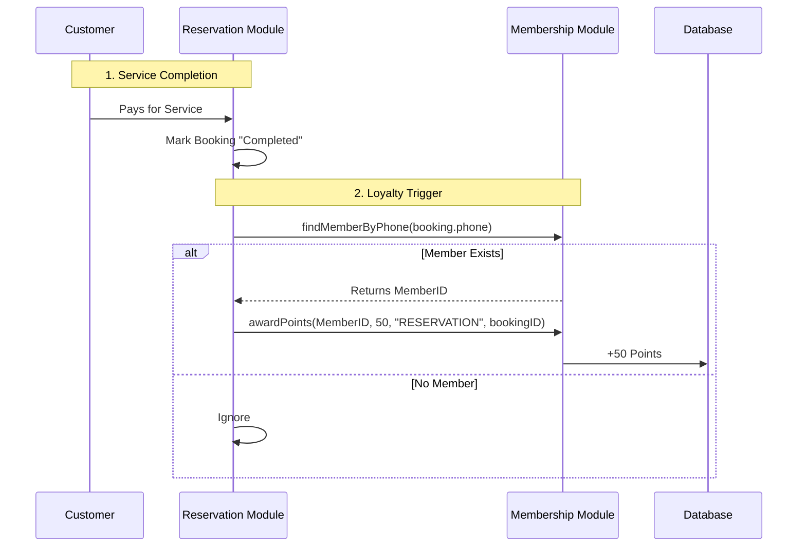
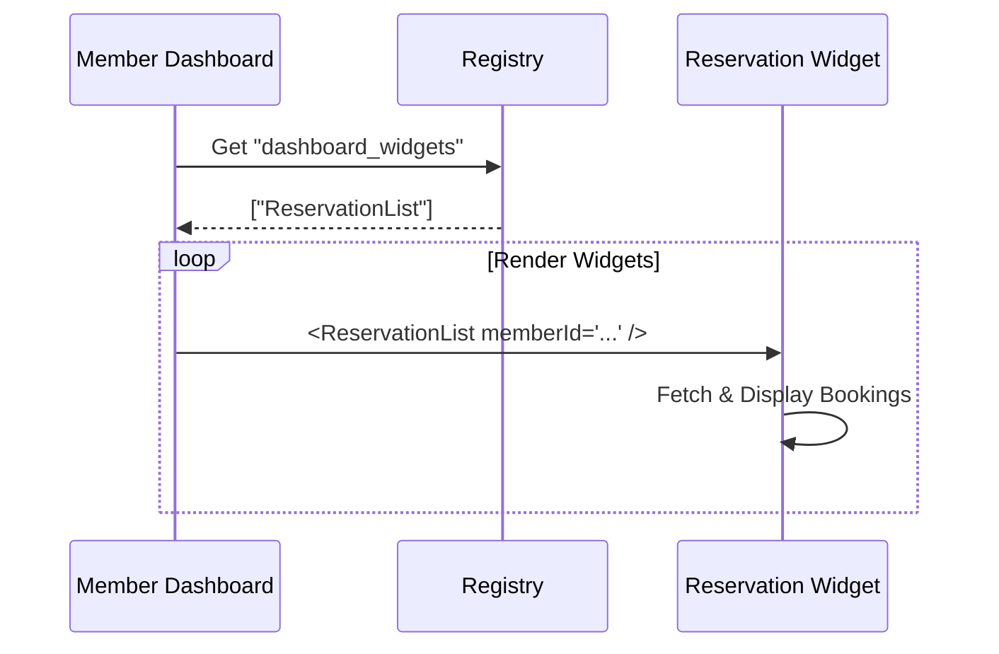

# Membership & Loyalty Module Architecture

>**Status**: Planning / Approved
>**Version**: 1.0

## Goal Description
Build a "Membership & Loyalty" module that allows customers to register, earn points on purchases/reservations, and tracks their accumulated loyalty points. This module acts as the **Central Identity Hub** for the modular system.

## Core Concepts

### 1. Unified Identity (CRM)
The `membership` module is the single source of truth for "Customers".
-   **POS** uses it to attach a customer to a sale.
-   **Reservation** uses it to attach a customer to a booking.
-   **Identifier**: Phone Number (Primary) or Email.

### 2. Loyalty Engine (Feature Flagged)
Loyalty is a sub-feature of Membership.
-   **Config**: `ableLoyalty` (bool) in settings.
-   **Logic**: Tracks `transactions` (Points Earned/Spent).
-   **API**: Generic `awardPoints()` contract.

### 3. Strict Modularity & Extensibility
To ensure robust, decoupled architecture:
-   **No Upstream Dependencies**: The `membership` module does **NOT** depend on `pos` or `reservation`.
-   **Public API Contract**: All interactions happen via `lib/modules/membership/api.ts`.
-   **Generic Source Tracking**: Transactions store `source: string` (e.g., "POS") rather than linking to specific collections.
-   **Widget Registry**: The "Member Dashboard" displays data from other modules (e.g., Upcoming Bookings) via a **Dynamic Widget Registry**, preventing circular dependencies.

---

## Data Schema (Firestore)

### `modules/membership/members`
Collections of registered members.
- `uid` (string): Auto-generated or Auth ID.
- `phoneNumber` (string): **Unique Index**.
- `email` (string, optional).
- `fullName` (string).
- `currentPoints` (number).
- `createdAt` (timestamp).
- `updatedAt` (timestamp).

### `modules/membership/transactions`
History of point changes.
- `id` (string).
- `memberId` (string).
- `source` (string): "POS", "RESERVATION", "MANUAL", "EVENTS", etc.
- `sourceRefId` (string): ID of the Order/Booking.
- `pointsDelta` (number): + or -.
- `description` (string).
- `createdAt` (timestamp).

---

## Technical Implementation

### Public API (`lib/modules/membership/api.ts`)
This is the **only** file other modules should import.
```typescript
// Find a member to attach to a generic transaction
export function findMemberByPhone(phone: string): Promise<Member | null>;

// Award points from ANY source
export function awardPoints(
  memberId: string, 
  amount: number, 
  source: string, 
  refId: string
): Promise<void>;
```

### Authentication Strategy (Pluggable)
The module supports multiple verification methods for the same identity (Phone/Email).
-   **Identifier**: Phone (Primary).
-   **Verification**: 
    -   Mock/PIN (MVP)
    -   SMS (Firebase/Twilio)
    -   WhatsApp (Meta/Twilio) - configurable adapter.
    -   Email Magic Link.

### Member Portal (`/member` routes)
-   **Login**: Generic "Enter ID -> Verify" flow.
-   **Dashboard**:
    -   **Header**: Member Card & Points.
    -   **Body**: Dynamic Widgets (loaded from Registry).
    -   Example: `ReservationWidget` renders here *if* Reservation module is active.

---

## User Journeys

### 1. Reservation -> Loyalty Flow


### 2. Dashboard Rendering (Widget Pattern)

