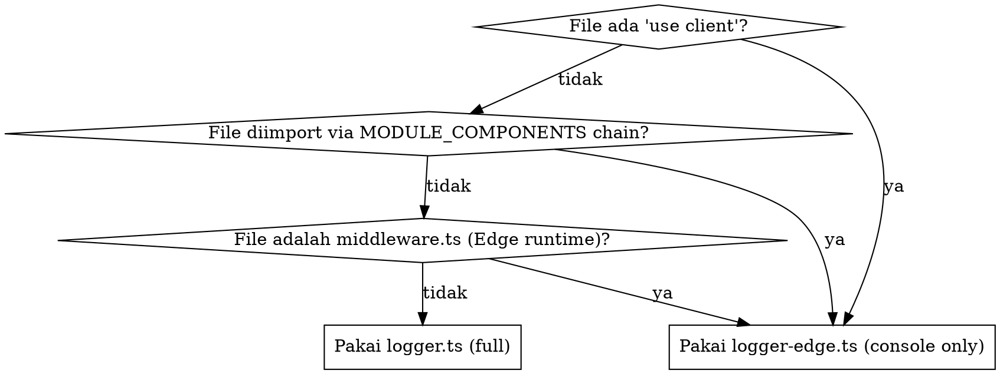

# Logger & Backyard Monitoring Audit

**Date:** 2026-04-26
**Branch:** dev-logging
**Status:** Implemented (Opsi A — Konservatif)

---

## Latar Belakang

Selama implementasi modul Stocklens, ditemukan dua masalah pada sistem logger:

1. **Build production gagal** — `firebase-admin` ikut ke client bundle melalui chain `@/lib/logger`
2. **`FIRESTORE_CRITICAL_EVENTS` whitelist tidak akurat** — berisi event yang tidak pernah dieksekusi (dead code) dan miss banyak event kritis yang seharusnya masuk monitoring

---

## Arsitektur Logger

### Dua varian logger yang tersedia

| File | Output | Firestore Write | Pakai di |
|---|---|---|---|
| `lib/logger.ts` | console + Firestore (whitelist) | ✅ via `firebase-admin` | API routes, server components, server utilities |
| `lib/logger-edge.ts` | console only | ❌ | Client components, Edge runtime, file yang masuk client bundle |

**Interface keduanya identik:** `logger.error(event, ctx)`, `logger.warn(...)`, `logger.info(...)` — bisa swap tanpa mengubah kode pemanggil.

### Aturan pemilihan logger



---

## Migrasi Logger di Branch dev-logging

20 file dimigrasi dari `@/lib/logger` ke `@/lib/logger-edge` karena masuk client bundle:

**Lib/modules client components:**
- `inventory/admin/AdjustStockDialog.tsx`, `inventory/admin/StockHistoryDrawer.tsx`, `inventory/admin/InventoryAdminPage.tsx`
- `byod_pos/api.ts`, `byod_pos/admin/CashierClient.tsx`, `byod_pos/admin/KDSClient.tsx`, `byod_pos/admin/POSClient.tsx`, `byod_pos/admin/components/BillCard.tsx`, `byod_pos/admin/components/POSOrderCard.tsx`, `byod_pos/hooks/useReceiptPrinter.ts`, `byod_pos/public/OrderPage.tsx`
- `membership/api.ts`
- `reservation/api.ts`, `reservation/admin/page.tsx`, `reservation/admin/components/AdminBookingWizard.tsx`, `reservation/admin/components/BookingDetailPanel.tsx`, `reservation/public/BookPage.tsx`, `reservation/public/BookingForm.tsx`, `reservation/public/ReservationWidget.tsx`, `reservation/public/steps/TimeStep.tsx`, `reservation/public/steps/DetailsStep.tsx`
- `sales-pipeline/api.ts`, `sales-pipeline/admin/PipelinePage.tsx`
- `service-records/api.ts`, `service-records/admin/RecordDetailPage.tsx`
- `stocklens/admin/SettingsPage.tsx`, `stocklens/admin/VaultPage.tsx`, `stocklens/admin/DetailPage.tsx`, `stocklens/admin/ScannerPage.tsx`

**Shared & registry:**
- `lib/admin-auth.ts`, `lib/cache/redis.ts`, `lib/fetchData.ts`, `lib/systemBlocks.ts`, `lib/templates/service.ts`, `lib/modules/registry.ts`
- `app/admin/login/page.tsx`, `app/admin/(dashboard)/canvas/page.tsx`
- `components/TemplateProvider.tsx`, `components/admin/blocks/PageStudioContext.tsx`

**File yang tetap pakai `@/lib/logger` (server-only):**
- Semua `app/api/**/route.ts`
- `lib/modules/{x}/server/*.ts`
- `lib/modules/byod_pos/api-server.ts`, `lib/whatsapp/*.ts`
- `lib/modules/ai-sales-agent/server/gemini-client.ts`, `lib/modules/stocklens/server/gemini-scanner.ts`

---

## Cleanup `FIRESTORE_CRITICAL_EVENTS`

### Sebelum (12 events, 6 dead)

```ts
const FIRESTORE_CRITICAL_EVENTS = new Set([
  'middleware.env.missing',           // ❌ Edge runtime, tidak bisa write
  'firebase.admin.init.failed',       // ❌ Tidak dipanggil di kode
  'auth.callback.failed',             // ❌ Hanya client (logger-edge)
  'upload.image.failed',              // ✅ API route
  'upload.avatar.failed',             // ✅ API route
  'wa.send.failed',                   // ✅ API route
  'wa.webhook.site.not.found',        // ✅ API webhook
  'ai.chat.failed',                   // ✅ API route
  'form.submit.failed',               // ✅ API route
  'pos.checkout.failed',              // ❌ Tidak dipanggil di kode
  'service.record.create.failed',     // ❌ Tidak dipanggil di kode
  'firestore.write.failed',           // ❌ Tidak dipanggil di kode
]);
```

### Sesudah (9 events, semua aktif)

```ts
const FIRESTORE_CRITICAL_EVENTS = new Set([
  'upload.image.failed',
  'upload.avatar.failed',
  'wa.send.failed',
  'wa.webhook.site.not.found',
  'ai.chat.failed',
  'form.submit.failed',
  'stocklens.scan.route.failed',
  'stocklens.apikey.fetch.failed',
  'stocklens.scan.parse.failed',
]);
```

---

## Audit Lengkap Event di API Routes

Sekitar 30 event aktif di server-side. Di-kategorisasi berdasarkan kekritisan:

### Tier 1 — Sudah di whitelist (kritis user-facing)

- `upload.image.failed`, `upload.avatar.failed` — upload gagal
- `wa.send.failed`, `wa.webhook.site.not.found` — WhatsApp delivery gagal
- `ai.chat.failed` — chatbot gagal
- `form.submit.failed` — form submission gagal
- `stocklens.scan.route.failed`, `stocklens.apikey.fetch.failed`, `stocklens.scan.parse.failed` — scan gagal

### Tier 2 — Belum di whitelist tapi worth dipertimbangkan

| Event | Module | Alasan |
|---|---|---|
| `auth.check.failed` | core | Login flow broken |
| `wa.webhook.process.failed` | whatsapp | Pesan masuk hilang |
| `team.add.failed`, `team.remove.failed` | core | Admin management gagal |
| `wa.connect.failed`, `wa.disconnect.failed` | whatsapp | Connection setup gagal |
| `ai.agent.config.failed` | ai-sales | Config save gagal |
| `ai.marketing.generate.failed` | ai-marketing | Generation gagal |
| `knowledge.sync.failed` | core | Knowledge base out of sync |

### Tier 3 — Tidak perlu di whitelist (noisy, non-critical)

| Event | Alasan |
|---|---|
| `form.create.failed`, `form.delete.failed`, `form.update.failed` | CRUD biasa, retry friendly |
| `form.fetch.failed` | Read failure, akan di-retry oleh client |
| `analytics.batch.failed` | Volume tinggi, akan crowd-out quota |
| `cache.purge.failed` | Tidak user-facing, cache fallback |
| `crm.submission.update.failed` | Bisa di-retry manual |
| `wa.test.failed` | Test connection, bukan production traffic |
| `wa.webhook.get.failed`, `wa.webhook.post.failed` | Tier 2 sudah cover via `wa.webhook.process.failed` |
| `team.add.auth.failed`, `team.remove.auth.failed` | Auth check tier, sudah cover |
| `stocklens.check-sku.failed`, `stocklens.settings.get.failed`, `stocklens.settings.post.failed` | Non-critical settings ops |

---

## Keputusan: Opsi A (Konservatif)

**Rasional:**
- Quota Firestore 500 writes/hari per platform — hemat untuk error kritis saja
- Event noisy/non-critical tetap masuk console (browser DevTools) dan GCP Cloud Logging (unlimited)
- Backyard Monitoring tab fokus ke event yang butuh perhatian admin segera

**Status implementasi saat ini:** Hanya Tier 1 (9 events) yang masuk whitelist. Tier 2 belum ditambahkan.

**Rencana penambahan Tier 2 (PR berikutnya, jika diperlukan):**
```ts
// Tambah saat masing-masing modul memerlukan visibility di Backyard:
'auth.check.failed',
'wa.webhook.process.failed',
'team.add.failed',
'team.remove.failed',
'ai.agent.config.failed',
'ai.marketing.generate.failed',
```

---

## Cara Menambah Event Baru ke Whitelist

Saat membuat modul baru atau menemukan event yang perlu monitoring:

1. Pastikan event di-trigger dari **server-side** (API route, server component, server utility) — gunakan `import { logger } from '@/lib/logger'`
2. Tambahkan event name ke `FIRESTORE_CRITICAL_EVENTS` di `lib/logger.ts`
3. Update `lib/logger.test.ts` jika ada test yang refer ke event tersebut
4. Verifikasi di Backyard Monitoring tab setelah deploy

**Jangan tambahkan event yang:**
- Hanya di-trigger dari client component (logger-edge tidak punya akses Firestore)
- High-volume / noisy (akan habiskan quota cepat)
- Non-critical / auto-recovery (cache miss, retry-able fetch, analytics batch)

---

## Impact Summary

### Build & Deploy
- ✅ `pnpm build` sebelumnya **gagal** karena `firebase-admin` di client bundle → sekarang sukses
- ✅ Production deploy unblocked
- ✅ Client bundle size lebih optimal (tanpa firebase-admin chain)

### Logging Behavior
- ✅ Console output identik di client & server (tidak ada perubahan format atau coverage)
- ✅ Server errors yang relevan tetap masuk Firestore via `@/lib/logger`
- ✅ Client errors tetap muncul di browser DevTools dan GCP Logs

### Backyard Monitoring
- ✅ 6 dead events dihapus dari whitelist (tidak akan muncul kosong)
- ✅ 3 stocklens events ditambahkan (production scan failures kini terdeteksi)
- ⚠️ Tier 2 events (auth, team, wa.webhook) masih bisa ditambahkan saat dibutuhkan

### Test
- ✅ `pnpm test lib/logger.test.ts` — 11/11 pass

---

## File-file Terkait

- `clicker-platform-v2/lib/logger.ts` — server logger dengan Firestore write
- `clicker-platform-v2/lib/logger-edge.ts` — edge/client logger console-only
- `clicker-platform-v2/lib/logger.test.ts` — test suite
- `backyard/` — dashboard yang menampilkan `platform_logs` collection

## Commits Terkait

- `9be31ac` — fix(platform): use logger-edge in client-bundled files to fix production build
- `5699871` — chore(logger): clean Firestore critical events whitelist + add stocklens
